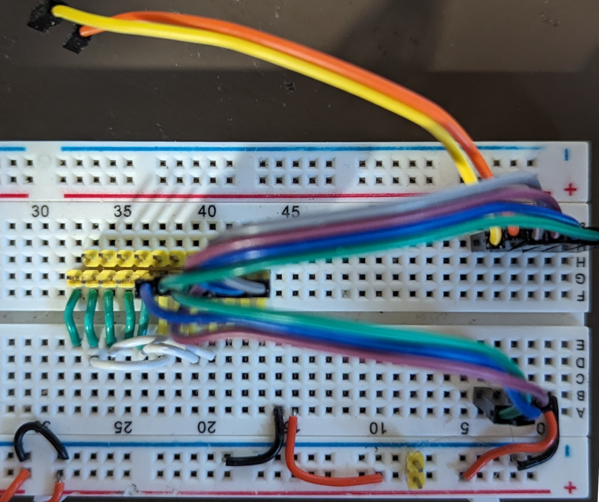

# Testing SPI displays #

A simple testbed for evaluating (some) SPI displays driven by XIAO form factor MCUs ... or others.  The initial testbed is built with a 62pin breadboard.  

The XIAO has a 7x2 pin configuration.  I have numbered the pins CCW starting with pin 1 as D0 and pin 14 as +5V

The SPI displays I have all use the same SPI pinout to drive the actual display, and they
use with two different drivers:

+ ST7789
+ ILI9341

The displays have three different touch screen modes:

+ No touch screen
+ Resistive touch screen with xpt2046 
Shared SPI bus with display.  Independent CS and IRQ pins
+ Capacitive touch screen with ft6206 
Uses I2C bus.  Independent RST and IRQ pins

**The TFT Display wiring is common for all the displays**

| Pin | StdUse | DispPin | ES32C3 | RP2    | NRF       |
|:----|--------|---------|--------|--------|-----------|
| 1   |        | BKLT    | GPIO02 | GPIO26 | P02(0.26) |
| 2   |        | RST     | GPIO03 | GPIO27 | P03(0.27) |
| 3   |        | DC      | GPIO04 | GPIO28 | P28(0.28) |
| 4   |        | CS      | GPIO05 | GPIO29 | P29(0.29) |
| 9   | SCK    | SCK     | GPIO08 | GPIO02 | P45(1.13) |
| 10  | MISO   | MISO    | GPIO09 | GPIO04 | P46(1.14) |
| 11  | MOSI   | MOSI    | GPIO10 | GPIO03 | P47(1.15) |

Note that the ESP32C3 uses GPIO09 as a strapping pin on startup.  If held low (e.g. by touch MISO on display!) the boot will be affected.  You may either switch to different pin or wait to attach MISO until after boot up.

**For resistive Touch screen 2 more pins are used, and 3 are shared for SPI.**

| Pin | StdUse | DispPin | ES32C3 | RP2    | NRF       |
|:----|--------|---------|--------|--------|-----------|
| 5   | SDA    | T_CS    | GPIO06 | GPIO06 | P04(0.04) |
| 6   | SCL    | T_IRQ   | GPIO07 | GPIO07 | P05(0.05) |

**For capacitive touch screen 4 more pins are used**

| Pin | StdUse | DispPin | ES32C3 | RP2    | NRF       |
|:----|--------|---------|--------|--------|-----------|
| 5   | SDA    | T_SDA   | GPIO06 | GPIO06 | P04(0.04) |
| 6   | SCL    | T_SDL   | GPIO07 | GPIO07 | P05(0.05) |
| 7   | TX     | T_IRQ   | GPIO21 | GPIO00 | P43(1.11) |
| 8   | RX     | T_RST   | GPIO20 | GPIO01 | P44(1.12) |

The display SPI connections in order (center of breadboard roughly) are:

| Loc | DispPin         |Note|
|:----|---|--|
| x   | Vcc             |
| x   | Gnd             |
| 1   | CS              |
| 2   | RST             |
| 3   | DC              |
| 4   | SDI/MOSI        |
| 5   | SCK             |
| 6   | BKLT            |
| 7   | SDO/MISO        |

**For resistive touch**

| Pin | Disp Label         |Note|
|:----|---|--|
| 8  | T_CLK-->5(SCK)  | Shared SPI for Touch and Disp |
| 9  | T_CS            |                               |
| 10 | T_DIN-->4(MOSI) | Shared SPI for Touch and Disp |
| 11 | T_DO-->7(MISO)  | Shared SPI for Touch and Disp |
| 12 | T_IRQ           |                               |

**For capacitive touch**

| Pin | Disp Label         |Note|
|:----|---|--|
| 8  | T_SCL           | I2C clock                     |
| 9  | T_RST           |                               |
| 10 | T_SDA           |                               |
| 11 | T_IRQ           |                               |
| 12 | SD CS           | micro SD, shared SPI          |

Here is the testbed, the yellow and orange disconnected wires are for resistive touch screen interrupt and chip select respectively.

{width="200px"} {width="200px"}

Simple but useful
