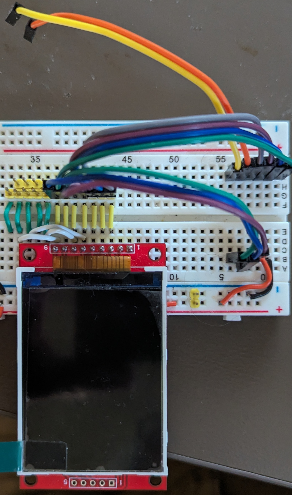

# Testing SPI displays #

A simple testbed for evaluating (some) SPI displays driven by XIAO form factor MCUs ... or others.  The initial testbed is built with a 62pin breadboard.  

The XIAO has a 7x2 pin configuration.  I have numbered the pins CCW starting with pin 1 as D0 and pin 14 as +5V

| Pin | StdUse | DispPin | ES32C3 | RP2    | NRF       |
|:----|--------|---------|--------|--------|-----------|
| 1   |        | BKLT    | GPIO02 | GPIO26 | P02(0.26) |
| 2   |        | RST     | GPIO03 | GPIO27 | P03(0.27) |
| 3   |        | DC      | GPIO04 | GPIO28 | P28(0.28) |
| 4   |        | CS      | GPIO05 | GPIO29 | P29(0.29) |
| 5   | SDA    | T_CS    | GPIO06 | GPIO06 | P04(0.04) |
| 6   | SCL    | T_IRQ   | GPIO07 | GPIO07 | P05(0.05) |
| 7   |        | nc      |        |        |           |
| 8   |        | nc      |        |        |           |
| 9   | SCK    | SCK     | GPIO08 | GPIO02 | P45(1.13) |
| 10  | MISO   | MISO    | GPIO09 | GPIO04 | P46(1.14) |
| 11  | MOSI   | MOSI    | GPIO10 | GPIO03 | P47(1.15) |

Note that the ESP32C3 uses GPIO09 as a strapping pin on startup.  If held low (e.g. by touch MISO on display!) the boot will be affected.  You may either switch to different pin or wait to attach MISO until after boot up.

The display SPI connections in order (center of breadboard roughly) are:

| Loc | DispPin         |Note|
|:----|---|--|
| x   | Vcc             |
| x   | Gnd             |
| 1   | CS              |
| 2   | RST             |
| 3   | DC              |
| 4   | SDI/MOSI        |
| 5   | SCK             |
| 6   | BKLT            |
| 7   | SDO/MISO        |
| 8   | T_CLK-->5(SCK)  |Shared SPI for Touch and Disp|
| 9   | T_CS            |
| 10  | T_DIN-->4(MOSI) |Shared SPI for Touch and Disp|
| 11  | T_DO-->7(MISO)  |Shared SPI for Touch and Disp|
| 12  | T_IRQ           |

Here is the testbed, the yellow and orange disconnected wires are for resistive touch screen interrupt and chip select respectively.

{width="200px"} {width="200px"}

Simple but useful
