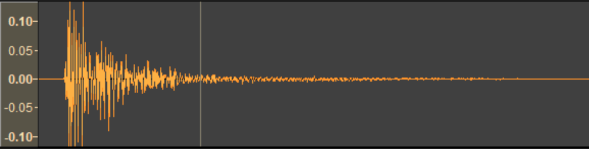
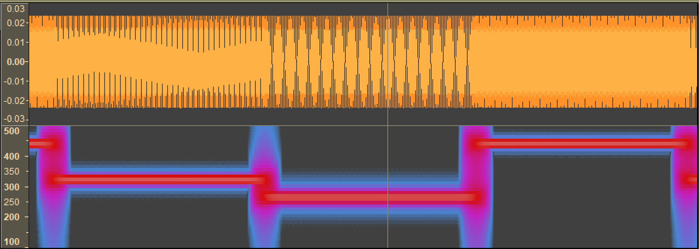
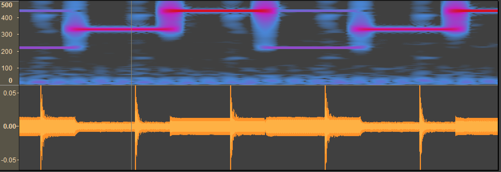
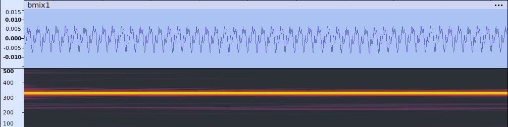

RP2040 with record.py
Program did not complete.  It hung up in the I2S object deinit.
Used phone apps to generate tone and metronome click
```
$ mpremote 
Connected to MicroPython at /dev/ttyACM0
Use Ctrl-] or Ctrl-x to exit this shell
MicroPython cebc9b0ae on 2024-06-21; XIAO RP2040 Local with RP2040
Type "help()" for more information.
>>> 
>>> import record
RP2040
Recording size: 88200 bytes
==========  START RECORDING ==========
0
I2S(id=0,
sck=6,
ws=7,
sd=26,
mode=0,
bits=16, format=0,
rate=22050, ibuf=40000)
80944
totnew:  100000
==========  DONE RECORDING ==========
84208
file closeddevice disconnected
```
* `mica440.wav`: a440 generated by Mike Teachman's play_tone.py using I2S
* `mica440c3.wav`: a440 generated by android app
* `micclick200.wav`:200 BPM metronome from android app


```
>>> import record
ESP32
Recording size: 88200 bytes
 I2S:
I2S(id=0,
sck=6,
ws=7,
sd=2,
mode=1,
bits=16, format=0,
rate=22050, ibuf=40000)
mic_samples size:  100000
mem_free:  66864
==========  START RECORDING ==========
totnew:  100000
==========  DONE RECORDING ==========
mem_free after record:  66768
mem_free before close: 66800
file closed
mem_free after close: 66800
I2S deinit complete
>>> 
$ mpremote cp :mic.wav a440c3.wav
......
$ mpremote cp :mic.wav clickc3.wav


```
-----------------------------------------------------
```
>>> import record
RP2040
Recording size: 88200 bytes
 I2S:
I2S(id=0,
sck=6,
ws=7,
sd=26,
mode=0,
bits=16, format=0,
rate=22050, ibuf=40000)
mic_samples size:  100000
mem_free:  82848
==========  START RECORDING ==========
totnew:  100000
==========  DONE RECORDING ==========
mem_free after record:  82752
# reset board
$ mpremote cp :mic.wav a440rp2.wav
.....
>>> import record
RP2040
Recording size: 88200 bytes
 I2S:
I2S(id=0,
sck=6,
ws=7,
sd=26,
mode=0,
bits=16, format=0,
rate=22050, ibuf=40000)
mic_samples size:  100000
mem_free:  84016
==========  START RECORDING ==========
caught exception OSError 28
# reset unplug reset unplug ...
$ mpremote cp :mic.wav micx.wav      # a440 not click
...
# mic.wav has 0 length on filesystem
# note: lag after printing recording size before I2S is printed
```
-------------------------------------------

XIAO esp32c3 (reportx.py)
```
$ mpremote
Connected to MicroPython at /dev/ttyACM0
Use Ctrl-] or Ctrl-x to exit this shell

>>> import recordx
>>> recordx.doit(wavfile="a440c3.wav")
ESP32C3 XIAO with ESP32C3
Recording size: 88200 bytes
 I2S:
I2S(id=0,
sck=6,
ws=7,
sd=2,
mode=1,
bits=16, format=0,
rate=22050, ibuf=40000)
mic_samples size:  100000
wav file:  a440c3.wav
mem_free:  67056
==========  START RECORDING ==========
totnew:  100000
==========  DONE RECORDING ==========
mem_free after record:  67024
mem_free before close: 67056
file closed
mem_free after close: 67056
I2S deinit complete
>>> recordx.doit(wavfile="beatc3.wav")
ESP32C3 XIAO with ESP32C3
Recording size: 88200 bytes
 I2S:
I2S(id=0,
sck=6,
ws=7,
sd=2,
mode=1,
bits=16, format=0,
rate=22050, ibuf=40000)
mic_samples size:  100000
wav file:  beatc3.wav
mem_free:  65456
==========  START RECORDING ==========
totnew:  100000
==========  DONE RECORDING ==========
mem_free after record:  65424
mem_free before close: 65456
file closed
mem_free after close: 65456
I2S deinit complete
>>> recordx.doit(wavfile="sbeatc3.wav",sampbfr=10000)
ESP32C3 XIAO with ESP32C3
Recording size: 88200 bytes
 I2S:
I2S(id=0,
sck=6,
ws=7,
sd=2,
mode=1,
bits=16, format=0,
rate=22050, ibuf=40000)
mic_samples size:  10000
wav file:  sbeatc3.wav
mem_free:  155520
==========  START RECORDING ==========
totnew:  10000
totnew:  10000
totnew:  10000
totnew:  10000
totnew:  10000
totnew:  10000
totnew:  10000
totnew:  10000
totnew:  10000
==========  DONE RECORDING ==========
mem_free after record:  155232
mem_free before close: 155520
file closed
mem_free after close: 155520
I2S deinit complete
>>> recordx.doit(wavfile="sa440c3.wav",sampbfr=10000)
ESP32C3 XIAO with ESP32C3
Recording size: 88200 bytes
 I2S:
I2S(id=0,
sck=6,
ws=7,
sd=2,
mode=1,
bits=16, format=0,
rate=22050, ibuf=40000)
mic_samples size:  10000
wav file:  sa440c3.wav
mem_free:  155520
==========  START RECORDING ==========
totnew:  10000
totnew:  10000
totnew:  10000
totnew:  10000
totnew:  10000
totnew:  10000
totnew:  10000
totnew:  10000
totnew:  10000
==========  DONE RECORDING ==========
mem_free after record:  155232
mem_free before close: 155520
file closed
mem_free after close: 155520
I2S deinit complete
>>> 

```
RP2040 does not complete when writing file to local filesystem while using I2S.  Delaying until after I2S is closed works


--------------
generic SDCard module from amazon- does not seem to like higher SPI baud on RP2... 6_000_000 works, but 10_000_000 does not.  Card on expansion board works at 25_000_000 baud.


things I learned

* convert bytes/bytearray with struct and array
* sdcard with RP2040 and with external module
* local file system writes on RP2040 are slow and impact I2S wav write
* deinit I2S before ending program or system can hang
* esp32c3 works and can write to local filesystem
* INMP441 needs to be initialized - read a few hundred milliseconds?
   - not necessarily ... maybe just time.  esp32c3 seems okay, rp2040 has glitch
* external sd reader weird  see `chkit.note`
   - keeping cabling tight and minimizing connections helps
   - external reader needs lower baud (related to length of connector)
   - esp32c3 seems pickier 
   - cheap reader - drops MISO to low when powering up, and fluctuates
   - cheap reader causes esp32c3 to reboot if powered up after mcu- power?

## Experiments ##

Recording results using:

*  `metronome beats` app on android phone to generate 2hz pulse.  Output was audio on the phone's speaker. The `mechanical` pulse was used.
	
	`met120.wav`: 20s, 22050, 16bits, mono, [-5275,6293]

* `ptone2.py` on a XIAO RP2040 with I2S to generate a sequence of 3 tones at 220hz, 330hz, 440hz at approximately 0.5s intervals. Output was audio through a simple portable direct wired speaker.
	
	`pt2_220_330_440.wav`: 44100,16 bits, mono, [-787, 788]
	
* `recordnf.py` using an INMP441 I2S microphone.  Small speaker was 'close' to breadboard with microphone and phone was held a few inches above the microphone.
	
	`bmix1.wav`: 20s, 22050, 16bits, mono, [-3682,3249]

    * 440: [-400,411]
    * 330: [-264,208]
	* 220: [-470,458]


	
